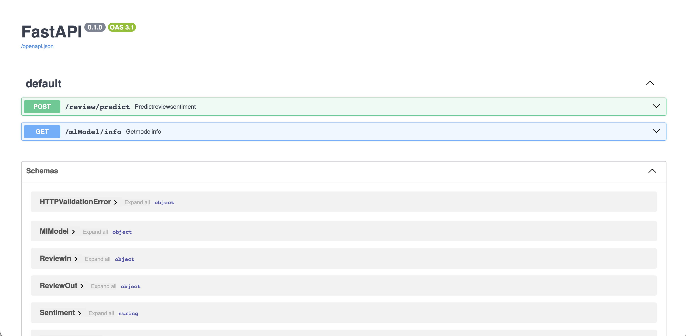

# movie-review-prediction-api
Multinomial Naive Bayes based model for predicting movie review sentiment exposed as REST API with FastAPI in Python

# Run locally

## Prerequisites
- python >= 3.11.3
- pip >= 23.2.1

## Steps
- Navigate to the project root directory
- From the terminal run the following commands serially inside this directory
    - `pip install -r requirements.txt`
    - `uvicorn app.main:app`

🎉 Great job! The application should now be running at `http://localhost:8000` 🎉

## Try out the API
You can now see the OpenAPI docs and try out the API endpoints by hitting the `http://localhost:8000/docs` endpoint which would bring up a page that looks like this:

